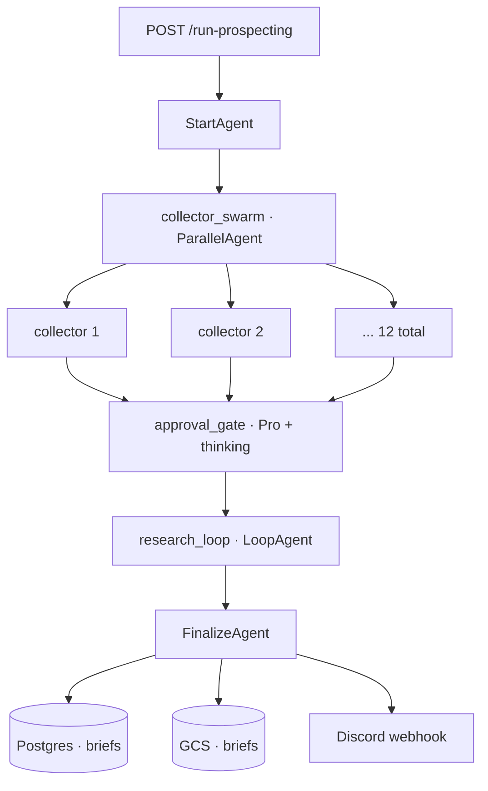

# prospecting-engine

Multi-agent research pipeline for the [KnavishMantis](https://youtube.com/@knavishmantis) YouTube channel. Vertex AI ADK + Gemini on Cloud Run.

Collects ideas from 12 sources — reddit, youtube comments, the Minecraft bug tracker, decompiled MC source code, and others — and runs strict editorial prompts that filter out 90%+ of ideas that don't fit the channel's style. Has produced highly unique shorts that wouldn't be found otherwise: *"Endermen secretly use a diamond axe"* came out of the code sub-agent reading decompiled Minecraft and surfacing a quirk in the source; the final video got 200K+ views.

A single `SequentialAgent` of four stages:

1. **StartAgent** — initializes the run, seeds session state.
2. **collector_swarm** — `ParallelAgent` of 12 source-specific collectors. Each is internally a `SequentialAgent(FetchAgent, AnalyzeAgent)`: deterministic Python fetch, then **Gemini 2.5 Flash** judging per-item relevance, embedding-dedup, insert.
3. **approval_gate** — `LlmAgent` on **Gemini 2.5 Pro with thinking**. Applies the editorial filter; tags `approved` / `rejected` / `duplicate`.
4. **research_loop** — `LoopAgent` of `[ResearchGate, research_agent]`. Picks an approved item, declares relationship (`faithful` / `pivot` / `discovery`), writes one validated brief per iteration via `store_brief_tool`.

`FinalizeAgent` writes briefs to Postgres + GCS; Discord webhook on completion.

**Stack:** Python · Vertex AI ADK · Gemini 2.5 Flash + Pro · FastAPI · Cloud Run · Cloud SQL · GCS · Secret Manager · Terraform · GitHub Actions.

## HTTP API

- `POST /run-prospecting` — backlog-driven trigger (consumer calls this when brief inventory is low; no scheduler in the engine)
- `POST /seed-idea` — manually-seeded idea
- `GET /status` — run telemetry
- `GET /health`

## Notes

- Flash for the 12 fan-out analyzers, Pro for the gate and research — per-call cost dominates at fan-out, reasoning quality matters downstream.
- Monthly LLM budget is a circuit-breaker, not a hint — every LLM call passes through `budget.check_budget()`; pipeline halts at 90% of the monthly cap.
- Backlog-driven, not cron — consumer calls `/run-prospecting`; engine has no scheduler.
- Plug-and-play consumer contract — engine writes only to its own table and GCS prefix; never reads anything the consumer adds.
- Dedup at insertion via embeddings — cheap rejection beats expensive rejection.
- All infra in Terraform; CI/CD via GitHub Actions on push to main.

## Source

Private (channel IP). This README documents the architecture.
