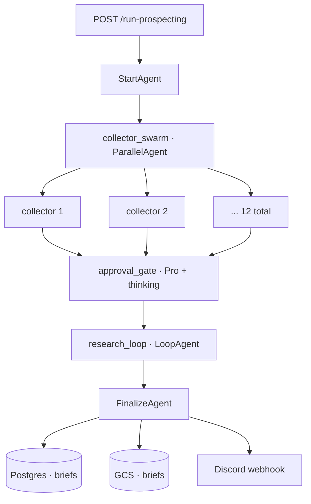

# prospecting-engine

A multi-agent research pipeline that generates validated content briefs for the [KnavishMantis](https://youtube.com/@knavishmantis) YouTube channel. Vertex AI ADK + Gemini, deployed to Cloud Run.

## Why this exists

Channel content is bottlenecked upstream of editing: finding ideas worth filming, with the research already done, takes hours per short by hand. The engine does that part continuously in the background so the human work collapses to scripting and filming.

It runs at ~$0.25 per brief, and roughly one in three of the briefs it produces ships as a short on a channel doing ~250K monthly views.

## What it does today

<!-- screenshot: a sample brief on knavishproductions.com/ideas -->

- Triggered over HTTP, produces a batch of validated briefs per invocation (bounded by the monthly LLM budget cap).
- Fans out across 12 source-specific collectors covering Minecraft-adjacent surfaces (community channels, official sources, source/data corpora, channel signals).
- Filters new candidates through an LLM gate, then runs deeper research on what survives.
- Writes briefs to a Postgres table + GCS inbox; downstream consumer site reads them for human review.
- Discord webhook notifies on completion.

<!-- screenshot: Discord run-completion notification -->

## Architecture

The pipeline is a single `SequentialAgent` composed of four stages.

1. **StartAgent** initializes a run and seeds session state.
2. **collector_swarm** is a `ParallelAgent` fan-out of 12 source-specific collectors. Each collector is internally a `SequentialAgent(FetchAgent, AnalyzeAgent)`: a deterministic Python fetch step, then an `LlmAgent` on **Gemini 2.5 Flash** that judges each item, embeds and dedups against the existing pool, and inserts what passes.
3. **approval_gate** is an `LlmAgent` on **Gemini 2.5 Pro with thinking**. It reads the new-ideas queue, applies the editorial filter, and tags each item `approved` / `rejected` / `duplicate`.
4. **research_loop** is a `LoopAgent` over `[ResearchGate, research_agent]`. The gate exits when the target brief count is reached or the budget trips. The research agent (Pro + thinking) picks an approved item, declares its relationship to the seed (`faithful`, `pivot`, or `discovery`), and writes one validated brief per iteration through the `store_brief_tool`.

`FinalizeAgent` writes run totals and lands the briefs in Postgres + GCS.

**Stack:** Python · Vertex AI ADK · Gemini 2.5 Flash + Pro (thinking) · FastAPI · Cloud Run · Cloud SQL Postgres · GCS · Secret Manager · Terraform · GitHub Actions · Docker.

## HTTP API

- `POST /run-prospecting` — backlog-driven trigger (consumer calls this when its brief inventory is low; no scheduler in the engine itself)
- `POST /seed-idea` — accept a manually-seeded idea
- `GET /status` — run-level telemetry
- `GET /health` — liveness probe

## Notes

- **Flash for the 12 fan-out analyzers, Pro for the gate and research stages.** Per-call cost dominates at fan-out scale; reasoning quality matters downstream.
- **The monthly LLM budget is a circuit-breaker, not a hint.** Every `LlmAgent` call passes through `budget.check_budget()` first. The pipeline halts when 90% of the monthly cap is reached.
- **Backlog-driven, not cron.** The consumer site calls `/run-prospecting` when brief inventory is low. The engine has no scheduler.
- **Plug-and-play consumer contract.** The engine writes only to its own table and GCS prefix; it never reads anything the consumer adds. The consumer can evolve freely.
- **Dedup at insertion, not after research.** New candidates are embedded and matched against the existing pool before they reach the gate — cheap rejection beats expensive rejection.
- **All infra in Terraform.** APIs, Cloud Run service, Cloud SQL, IAM, GCS, Secret Manager. CI/CD via GitHub Actions on push to main.

## Source

Source is private (channel IP). This README documents the architecture.
